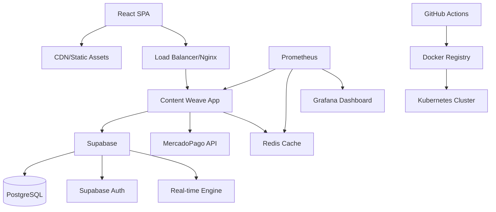
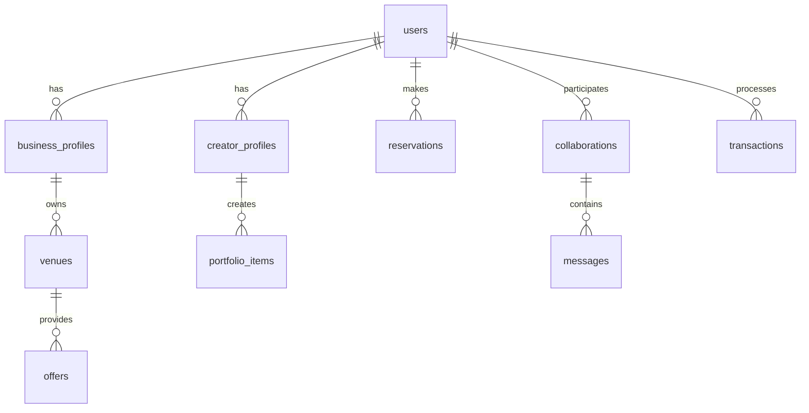
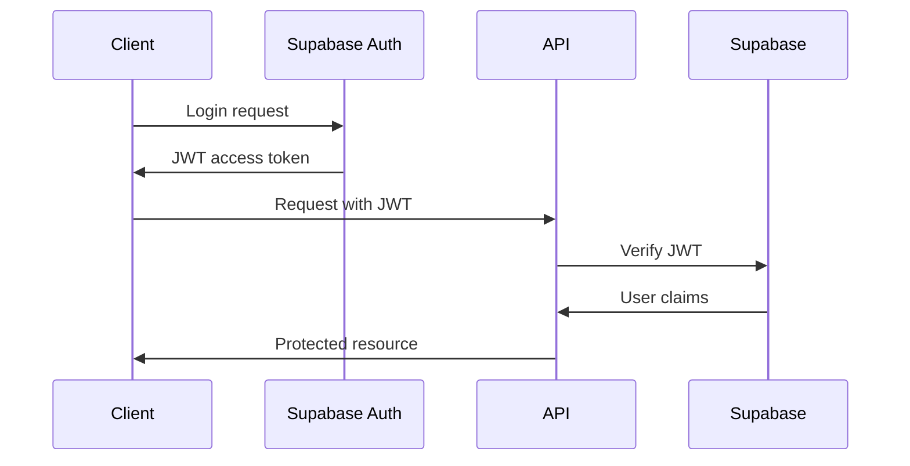
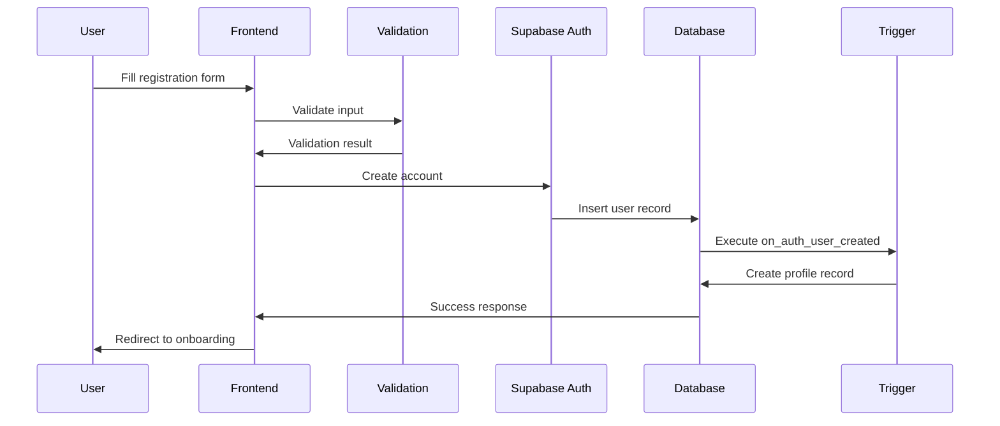
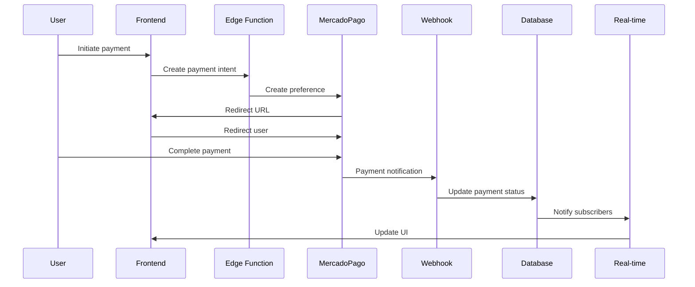
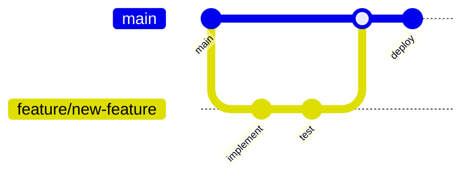

# Content Weave Platform Architecture

## Overview

Content Weave is a sophisticated content creator and business collaboration platform built using modern web technologies. The architecture follows microservices principles with a React frontend, Supabase backend, and comprehensive DevOps infrastructure.

## System Architecture

### High-Level Architecture



## Technology Stack

### Frontend Architecture

#### Core Technologies
- **React 18**: Modern React with concurrent features
- **TypeScript**: Full type safety across the application
- **Vite**: Lightning-fast build tool and dev server
- **React Router**: Client-side routing with lazy loading

#### State Management
- **TanStack Query**: Server state management with caching
- **React Context**: Local state and user session management
- **React Hook Form**: Form state with optimistic updates
- **Zustand**: Lightweight state management for complex flows

#### UI Framework
- **Tailwind CSS**: Utility-first CSS framework
- **Radix UI**: Unstyled, accessible component primitives
- **Lucide React**: Consistent icon system
- **Class Variance Authority**: Type-safe component variants

### Backend Architecture

#### Database Layer


#### Supabase Services
- **PostgreSQL**: Primary data store with advanced features
- **Row Level Security**: Fine-grained access control
- **Real-time**: WebSocket-based live updates  
- **Auth**: JWT-based authentication system
- **Edge Functions**: Serverless API endpoints
- **Storage**: File and media management

#### Database Optimizations
- **15+ Strategic Indexes**: Query performance optimization
- **Materialized Views**: Complex analytics pre-computation
- **Full-text Search**: Advanced content discovery
- **Partitioning**: Large table performance optimization

### Infrastructure Architecture

#### Containerization
```dockerfile
# Multi-stage build for optimization
FROM node:18-alpine AS builder
# Build application

FROM nginx:alpine AS runtime  
# Serve optimized build
```

#### Kubernetes Deployment
```yaml
apiVersion: apps/v1
kind: Deployment
metadata:
  name: content-weave
spec:
  replicas: 3
  strategy:
    type: RollingUpdate
    rollingUpdate:
      maxSurge: 1
      maxUnavailable: 0
```

#### Monitoring Stack
- **Prometheus**: Metrics collection and alerting
- **Grafana**: Visualization and dashboards
- **Alert Manager**: Intelligent alert routing
- **Jaeger**: Distributed tracing (planned)

## Design Patterns

### Frontend Patterns

#### Component Architecture
```typescript
// Compound component pattern
const Modal = {
  Root: ModalRoot,
  Trigger: ModalTrigger,
  Content: ModalContent,
  Header: ModalHeader,
  Footer: ModalFooter
}

// Usage
<Modal.Root>
  <Modal.Trigger>Open</Modal.Trigger>
  <Modal.Content>
    <Modal.Header>Title</Modal.Header>
    Content here
    <Modal.Footer>Actions</Modal.Footer>
  </Modal.Content>
</Modal.Root>
```

#### Custom Hooks Pattern
```typescript
// Domain-specific hooks
const useAuth = () => {
  const { user, profile, loading } = useContext(AuthContext)
  return { user, profile, loading, signIn, signOut, updateProfile }
}

const useCollaborations = (userId: string) => {
  return useQuery(['collaborations', userId], 
    () => fetchCollaborations(userId)
  )
}
```

#### Error Boundary Pattern
```typescript
class ErrorBoundary extends Component<Props, State> {
  static getDerivedStateFromError(error: Error): State {
    return { hasError: true, error }
  }

  componentDidCatch(error: Error, errorInfo: ErrorInfo) {
    logErrorToService(error, errorInfo)
  }
}
```

### Backend Patterns

#### Repository Pattern
```sql
-- RLS policies for data access control
CREATE POLICY "Users can view own profile" ON creator_profiles
  FOR SELECT USING (auth.uid() = user_id);

CREATE POLICY "Public can view published profiles" ON creator_profiles
  FOR SELECT USING (is_public = true);
```

#### Observer Pattern
```sql
-- Real-time subscriptions
CREATE OR REPLACE FUNCTION notify_collaboration_update()
RETURNS trigger AS $$
BEGIN
  PERFORM pg_notify('collaboration_updates', 
    json_build_object('id', NEW.id, 'status', NEW.status)::text
  );
  RETURN NEW;
END;
$$ LANGUAGE plpgsql;
```

## Security Architecture

### Authentication Flow


### Authorization Model
- **Role-Based Access Control (RBAC)**: User roles (creator, business, admin)
- **Row Level Security (RLS)**: Database-level access control
- **JWT Claims**: Stateless authorization
- **API Rate Limiting**: DDoS protection and fair usage

### Security Layers
1. **Network Security**: CORS, CSP, security headers
2. **Authentication**: Multi-factor authentication support
3. **Authorization**: Fine-grained permissions
4. **Data Protection**: Encryption at rest and in transit
5. **Input Validation**: Comprehensive Zod schemas
6. **Output Sanitization**: XSS prevention

## Performance Architecture

### Frontend Optimizations

#### Code Splitting Strategy
```typescript
// Route-level splitting
const Dashboard = lazy(() => import('./pages/Dashboard'))
const Profile = lazy(() => import('./pages/Profile'))

// Component-level splitting
const Charts = lazy(() => import('./components/Charts'))
```

#### Bundle Optimization
```typescript
// Vite configuration
export default defineConfig({
  build: {
    rollupOptions: {
      output: {
        manualChunks: {
          vendor: ['react', 'react-dom'],
          ui: ['@radix-ui/*', 'lucide-react'],
          forms: ['react-hook-form', 'zod'],
          charts: ['recharts']
        }
      }
    }
  }
})
```

#### Caching Strategy
- **Browser Caching**: Static assets with long-term caching
- **Service Worker**: Application-level caching (planned)
- **CDN**: Global content distribution
- **API Caching**: TanStack Query with stale-while-revalidate

### Backend Optimizations

#### Database Performance
```sql
-- Strategic indexes
CREATE INDEX CONCURRENTLY idx_collaborations_status_created 
  ON collaborations (status, created_at DESC);

CREATE INDEX CONCURRENTLY idx_creators_specialties_gin 
  ON creator_profiles USING GIN (specialties);

-- Materialized views for analytics
CREATE MATERIALIZED VIEW creator_stats AS
SELECT 
  creator_id,
  COUNT(*) as total_collaborations,
  AVG(rating) as average_rating,
  SUM(CASE WHEN status = 'completed' THEN 1 ELSE 0 END) as completed_count
FROM collaborations 
GROUP BY creator_id;
```

#### Connection Pooling
```typescript
// Supabase connection configuration
const supabase = createClient(url, key, {
  db: {
    schema: 'public'
  },
  auth: {
    autoRefreshToken: true,
    persistSession: true
  },
  realtime: {
    params: {
      eventsPerSecond: 10
    }
  }
})
```

## Scalability Considerations

### Horizontal Scaling
- **Stateless Application**: No server-side session storage
- **Database Read Replicas**: Distribute read operations
- **CDN Distribution**: Global asset delivery
- **Auto-scaling**: Kubernetes HPA based on metrics

### Vertical Scaling
- **Resource Optimization**: Memory and CPU profiling
- **Database Tuning**: Query optimization and indexing
- **Caching Layers**: Redis for session and data caching

### Future Scaling Plans
- **Microservices Migration**: Domain-specific services
- **Event Sourcing**: Audit trail and state reconstruction
- **CQRS**: Separate read and write operations
- **Message Queues**: Asynchronous processing

## Data Flow Architecture

### User Registration Flow


### Payment Processing Flow


## API Architecture

### RESTful Design
```typescript
// Resource-based URLs
GET    /api/creators                 // List creators
GET    /api/creators/:id             // Get creator
POST   /api/creators                 // Create creator  
PUT    /api/creators/:id             // Update creator
DELETE /api/creators/:id             // Delete creator

// Nested resources
GET    /api/creators/:id/portfolio   // Creator's portfolio
POST   /api/collaborations           // Create collaboration
GET    /api/collaborations/:id/messages // Collaboration messages
```

### GraphQL Considerations
```graphql
# Future GraphQL schema
type Creator {
  id: ID!
  profile: CreatorProfile!
  portfolio: [PortfolioItem!]!
  collaborations(status: CollaborationStatus): [Collaboration!]!
  analytics: CreatorAnalytics!
}

type Query {
  creator(id: ID!): Creator
  creators(filter: CreatorFilter, pagination: Pagination): CreatorConnection!
}
```

## Development Architecture

### Development Workflow


### CI/CD Pipeline
```yaml
# .github/workflows/deploy.yml
name: Deploy
on:
  push:
    branches: [main]

jobs:
  test:
    runs-on: ubuntu-latest
    steps:
      - uses: actions/checkout@v3
      - name: Run tests
        run: npm run test:ci
      
  build:
    needs: test
    runs-on: ubuntu-latest
    steps:
      - name: Build application
        run: npm run build
      
  deploy:
    needs: build
    runs-on: ubuntu-latest
    steps:
      - name: Deploy to Kubernetes
        run: kubectl apply -f k8s/
```

### Testing Architecture
```typescript
// Test pyramid structure
describe('Authentication', () => {
  // Unit tests (70%)
  describe('AuthService', () => {
    it('should validate email format', () => {})
    it('should hash passwords securely', () => {})
  })
  
  // Integration tests (20%)
  describe('Auth Flow', () => {
    it('should login and redirect to dashboard', () => {})
  })
  
  // E2E tests (10%)
  describe('User Journey', () => {
    it('should complete full registration flow', () => {})
  })
})
```

## Monitoring Architecture

### Metrics Collection
```typescript
// Custom metrics
const registerMetrics = () => {
  // Business metrics
  prometheus.register.registerMetric(new prometheus.Counter({
    name: 'user_registrations_total',
    help: 'Total number of user registrations'
  }))
  
  // Technical metrics
  prometheus.register.registerMetric(new prometheus.Histogram({
    name: 'http_request_duration_seconds',
    help: 'HTTP request duration in seconds'
  }))
}
```

### Alerting Rules
```yaml
# prometheus/alerts.yml
groups:
- name: application
  rules:
  - alert: HighErrorRate
    expr: rate(http_requests_total{status=~"5.."}[5m]) > 0.1
    for: 5m
    annotations:
      summary: High error rate detected
      
  - alert: DatabaseConnectionPool
    expr: db_connections_active / db_connections_max > 0.8
    for: 2m
    annotations:
      summary: Database connection pool nearly exhausted
```

## Future Architecture Plans

### Short-term (3-6 months)
- **Service Worker**: Offline functionality and caching
- **WebRTC Integration**: Direct creator-business communication
- **Advanced Analytics**: Real-time business intelligence
- **Mobile App**: React Native implementation

### Medium-term (6-12 months)
- **Microservices Migration**: Domain-specific services
- **Event Sourcing**: Complete audit trail implementation
- **Machine Learning**: Creator-business matching algorithm
- **Global CDN**: Multi-region content delivery

### Long-term (12+ months)
- **Blockchain Integration**: Creator reputation and rewards
- **AI-Powered Features**: Content generation and optimization
- **Multi-tenant Architecture**: White-label platform support
- **Edge Computing**: Regional data processing

## Architecture Decisions

### Technology Choices

#### Frontend Framework: React
**Decision**: React 18 with TypeScript
**Reasoning**: 
- Large ecosystem and community support
- Excellent TypeScript integration
- Modern features (Suspense, Concurrent Mode)
- Strong team expertise

**Alternatives Considered**: Vue.js, Svelte
**Trade-offs**: Learning curve for complex state management

#### Backend: Supabase
**Decision**: Supabase as Backend-as-a-Service
**Reasoning**:
- Rapid development and deployment
- Built-in authentication and authorization
- Real-time capabilities out of the box
- PostgreSQL with advanced features

**Alternatives Considered**: Firebase, AWS Amplify, Custom Node.js
**Trade-offs**: Vendor lock-in, less control over infrastructure

#### Database: PostgreSQL
**Decision**: PostgreSQL through Supabase
**Reasoning**:
- ACID compliance for financial transactions
- Advanced features (JSON, full-text search, arrays)
- Excellent performance with proper indexing
- Strong consistency guarantees

**Alternatives Considered**: MongoDB, MySQL
**Trade-offs**: Requires more expertise for optimization

### Architectural Patterns

#### Single Page Application (SPA)
**Decision**: Client-side rendered SPA
**Reasoning**:
- Rich interactive user experience
- Efficient caching and offline capabilities
- Clear separation of concerns
- Excellent developer experience

**Alternatives Considered**: Server-side rendering (SSR), Static site generation (SSG)
**Trade-offs**: Initial load time, SEO considerations

#### Component-Based Architecture
**Decision**: Modular, reusable component design
**Reasoning**:
- Code reusability and maintainability
- Clear separation of concerns
- Easy testing and debugging
- Scalable development process

**Alternatives Considered**: Page-based architecture
**Trade-offs**: Initial complexity, learning curve

## Conclusion

The Content Weave platform architecture is designed for scalability, maintainability, and developer productivity. The modular design allows for incremental improvements and feature additions while maintaining system stability and performance.

Key architectural strengths:
- **Scalable**: Horizontal and vertical scaling capabilities
- **Secure**: Multiple security layers and best practices
- **Performant**: Optimized frontend and backend performance
- **Maintainable**: Clean code architecture and comprehensive testing
- **Observable**: Comprehensive monitoring and alerting

The architecture supports the platform's mission to connect content creators and businesses through innovative collaboration technology while maintaining high standards for security, performance, and user experience.