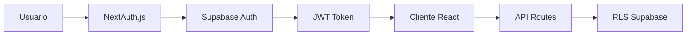
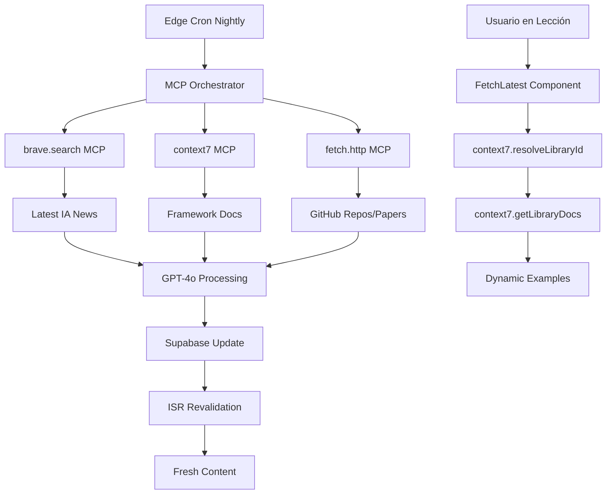
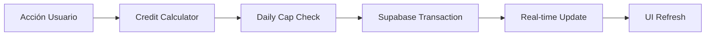
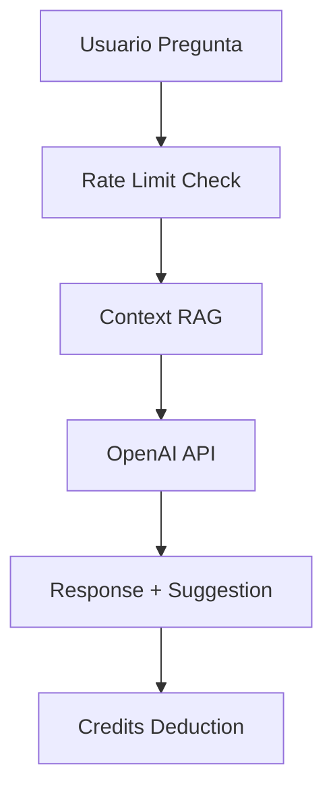

# AIClases 4.0 - Arquitectura Técnica

## 🏗️ Estructura de Carpetas

```
aiclases-4.0/
├── apps/
│   ├── web/                          # Next.js 14 App Principal
│   │   ├── app/                      # App Router
│   │   │   ├── (auth)/              # Grupo de rutas autenticadas
│   │   │   │   ├── login/
│   │   │   │   ├── register/
│   │   │   │   └── layout.tsx
│   │   │   ├── (dashboard)/         # Dashboard usuario
│   │   │   │   ├── courses/
│   │   │   │   ├── progress/
│   │   │   │   ├── credits/
│   │   │   │   └── profile/
│   │   │   ├── (learning)/          # Experiencia de aprendizaje
│   │   │   │   ├── course/[slug]/
│   │   │   │   ├── lesson/[id]/
│   │   │   │   └── mentor/
│   │   │   ├── (marketing)/         # Landing y páginas públicas
│   │   │   │   ├── pricing/
│   │   │   │   ├── blog/
│   │   │   │   └── about/
│   │   │   ├── api/                 # API Routes
│   │   │   │   ├── auth/
│   │   │   │   ├── courses/
│   │   │   │   ├── payments/
│   │   │   │   ├── mentor/
│   │   │   │   └── cron/
│   │   │   ├── globals.css
│   │   │   ├── layout.tsx
│   │   │   ├── page.tsx
│   │   │   ├── loading.tsx
│   │   │   ├── error.tsx
│   │   │   └── not-found.tsx
│   │   ├── components/              # Componentes específicos de web
│   │   ├── lib/                     # Utilidades y configuraciones
│   │   │   ├── auth.ts
│   │   │   ├── supabase.ts
│   │   │   ├── payments.ts
│   │   │   └── mcp/
│   │   ├── public/
│   │   │   ├── icons/
│   │   │   ├── images/
│   │   │   ├── manifest.json
│   │   │   └── sw.js
│   │   ├── styles/
│   │   ├── next.config.js
│   │   ├── tailwind.config.ts
│   │   └── package.json
│   └── storybook/                   # Storybook standalone
├── packages/
│   ├── ui/                          # @aiclases/ui - Design System
│   │   ├── src/
│   │   │   ├── components/          # Componentes Radix + Shadcn
│   │   │   │   ├── atoms/           # Button, Input, Badge
│   │   │   │   ├── molecules/       # Card, Form, Modal
│   │   │   │   ├── organisms/       # Header, Sidebar, CoursePlayer
│   │   │   │   └── templates/       # PageLayout, CourseLayout
│   │   │   ├── hooks/               # Custom hooks compartidos
│   │   │   ├── utils/               # Utilidades UI
│   │   │   ├── styles/              # Tokens CSS, variables globales
│   │   │   │   ├── tokens.ts        # Design tokens
│   │   │   │   ├── globals.css
│   │   │   │   └── themes.css       # Dark/Light themes
│   │   │   └── index.ts
│   │   ├── package.json
│   │   └── tailwind.config.ts
│   ├── database/                    # @aiclases/database - Supabase
│   │   ├── src/
│   │   │   ├── types/               # TypeScript types generados
│   │   │   ├── queries/             # Query builders
│   │   │   ├── mutations/           # Mutations helpers
│   │   │   └── index.ts
│   │   ├── supabase/
│   │   │   ├── migrations/          # SQL migrations
│   │   │   ├── seeds/               # Data seeds
│   │   │   └── config.toml
│   │   └── package.json
│   ├── ai/                          # @aiclases/ai - IA/MCP
│   │   ├── src/
│   │   │   ├── mentor/              # MentorAI logic
│   │   │   ├── content-updater/     # Auto-update content
│   │   │   ├── mcp-tools/           # MCP integrations
│   │   │   └── index.ts
│   │   └── package.json
│   ├── shared/                      # @aiclases/shared - Utils
│   │   ├── src/
│   │   │   ├── constants/
│   │   │   ├── types/
│   │   │   ├── utils/
│   │   │   └── index.ts
│   │   └── package.json
│   └── eslint-config/               # @aiclases/eslint-config
├── docs/                            # Documentación
├── .github/
│   └── workflows/                   # CI/CD GitHub Actions
├── turbo.json                       # Configuración Turborepo
├── package.json                     # Root package.json
├── pnpm-workspace.yaml             # PNPM workspace
└── README.md
```

## 🔄 Flujo de Datos

### 1. Autenticación y Sesiones


### 2. Contenido Dinámico y Auto-Actualización


### 3. Economía AICredits


### 4. MentorAI Flow


## 🎯 SEO & Performance

### Next.js SEO Implementation
```typescript
// app/layout.tsx
export const metadata: Metadata = {
  title: {
    default: 'AIClases - Escuela Digital de Inteligencia Artificial',
    template: '%s | AIClases'
  },
  description: 'Cursos prácticos de IA que se auto-actualizan con las últimas tendencias.',
  keywords: ['inteligencia artificial', 'cursos online', 'programación', 'productividad'],
  authors: [{ name: 'AIClases Team' }],
  robots: 'index, follow',
  openGraph: {
    type: 'website',
    locale: 'es_ES',
    alternateLocale: ['en_US', 'pt_BR'],
    siteName: 'AIClases'
  }
}
```

### Optimizaciones Core
- **ISR (Incremental Static Regeneration):** Cursos se rebuildan automáticamente
- **Static Generation:** Landing pages estáticas
- **Dynamic Imports:** Code splitting por ruta
- **Image Optimization:** Next.js Image component + Supabase Storage
- **Font Optimization:** Inter Variable + JetBrains Mono via next/font

### Sitemap Dinámico
```typescript
// app/sitemap.ts
export default async function sitemap(): Promise<MetadataRoute.Sitemap> {
  const courses = await getCourses()
  
  const courseUrls = courses.map(course => ({
    url: `https://aiclases.com/course/${course.slug}`,
    lastModified: course.updatedAt,
    changeFrequency: 'weekly' as const,
    priority: 0.8
  }))

  return [
    { url: 'https://aiclases.com', priority: 1.0 },
    { url: 'https://aiclases.com/courses', priority: 0.9 },
    ...courseUrls
  ]
}
```

## 📱 PWA Configuration

### Manifest.json
```json
{
  "name": "AIClases - Escuela Digital IA",
  "short_name": "AIClases",
  "description": "Aprende IA con cursos que se actualizan solos",
  "theme_color": "#2563EB",
  "background_color": "#0F172A",
  "display": "standalone",
  "orientation": "portrait",
  "scope": "/",
  "start_url": "/dashboard",
  "icons": [
    {
      "src": "/icons/icon-192.png",
      "sizes": "192x192",
      "type": "image/png",
      "purpose": "any maskable"
    },
    {
      "src": "/icons/icon-512.png", 
      "sizes": "512x512",
      "type": "image/png"
    }
  ]
}
```

### Service Worker Strategy
- **Network First:** API calls y contenido dinámico
- **Cache First:** Assets estáticos e imágenes
- **Offline Fallback:** Página offline básica
- **Background Sync:** Progreso offline sincronizado

## 🔄 Auto-Actualización de Contenido

### Edge Cron Implementation
```typescript
// app/api/cron/update-content/route.ts
export async function GET(request: Request) {
  const authHeader = request.headers.get('authorization')
  if (authHeader !== `Bearer ${process.env.CRON_SECRET}`) {
    return new Response('Unauthorized', { status: 401 })
  }

  try {
    // 1. Ejecutar MCP tools en paralelo
    const [braveResults, context7Updates, githubRepos] = await Promise.allSettled([
      braveSearch('artificial intelligence trends last 7 days'),
      syncFrameworkDocs(), // Context7 MCP
      fetchTrendingRepos() // fetch.http MCP
    ])
    
    // 2. Process with GPT-4o mini for course integration
    const courseUpdates = await processAllSources({
      news: braveResults.status === 'fulfilled' ? braveResults.value : null,
      docs: context7Updates.status === 'fulfilled' ? context7Updates.value : null,
      repos: githubRepos.status === 'fulfilled' ? githubRepos.value : null
    })
    
    // 3. Update Supabase content
    await updateCourseContent(courseUpdates)
    
    // 4. Trigger ISR revalidation
    await revalidateTag('courses')
    
    return Response.json({ 
      success: true, 
      updated: courseUpdates.length,
      sources: {
        brave: braveResults.status,
        context7: context7Updates.status,
        github: githubRepos.status
      }
    })
  } catch (error) {
    return Response.json({ error: error.message }, { status: 500 })
  }
}
```

### Content Integration Flow
1. **Weekly Cron** ejecuta múltiples MCP tools (Domingos 02:00 UTC)
2. **Context7 Sync** obtiene docs actualizadas de frameworks
3. **AI Processing** resume y adapta todo el contenido
4. **Database Update** inserta nuevos ejemplos/citas versionados
5. **Cache Invalidation** revalida páginas afectadas
6. **User Experience** ve contenido fresco sin intervención

### Context7 Integration Specifics
```typescript
// lib/mcp/context7-sync.ts
async function syncFrameworkDocs() {
  const frameworks = [
    '/vercel/next.js',
    '/supabase/supabase', 
    '/tailwindlabs/tailwindcss',
    '/facebook/react'
  ]

  const updates = await Promise.all(
    frameworks.map(async (libraryId) => {
      const docs = await context7.getLibraryDocs({
        libraryId,
        tokens: 15000,
        topic: 'latest-features'
      })
      
      return processFrameworkUpdate(libraryId, docs)
    })
  )

  return updates.filter(update => update.hasChanges)
}
```

## 🏢 Turborepo Orchestration

### Build Pipeline
```json
{
  "pipeline": {
    "build": {
      "dependsOn": ["^build"],
      "outputs": [".next/**", "dist/**", "build/**"]
    },
    "dev": {
      "cache": false,
      "persistent": true
    },
    "lint": {},
    "type-check": {
      "dependsOn": ["^build"]
    },
    "test": {
      "dependsOn": ["^build"],
      "inputs": ["src/**/*.tsx", "src/**/*.ts", "test/**/*.ts"]
    }
  }
}
```

### Package Dependencies
- `apps/web` → depende de `packages/ui`, `packages/database`, `packages/ai`
- `packages/ui` → independiente, exporta design system
- `packages/database` → maneja Supabase types y queries
- `packages/ai` → MCP tools y MentorAI logic

## 🔐 Seguridad y RLS

### Row Level Security Policies
```sql
-- Usuarios solo ven su propio progreso
CREATE POLICY "Users can view own progress" ON user_progress
FOR ALL USING (auth.uid() = user_id);

-- Cursos públicos para todos
CREATE POLICY "Courses are viewable by everyone" ON courses
FOR SELECT USING (true);

-- Credits solo para propietario
CREATE POLICY "Credits only for owner" ON user_credits
FOR ALL USING (auth.uid() = user_id);
```

### API Route Protection
```typescript
// lib/auth.ts
export async function requireAuth(request: Request) {
  const token = await getToken({ req: request })
  if (!token) {
    throw new Error('Unauthorized')
  }
  return token
}
```

## 📊 Monitoring y Analytics

### Performance Tracking
- **Vercel Analytics:** Métricas de performance automáticas
- **Core Web Vitals:** LCP, FID, CLS tracking
- **Custom Events:** Progreso de curso, engagement

### Error Monitoring
- **Next.js Error Boundary:** Captura errores React
- **API Error Handling:** Respuestas consistentes
- **Client-side Logging:** Errores críticos a Supabase

Esta arquitectura garantiza escalabilidad, mantenibilidad y una experiencia de usuario excepcional con contenido siempre actualizado.