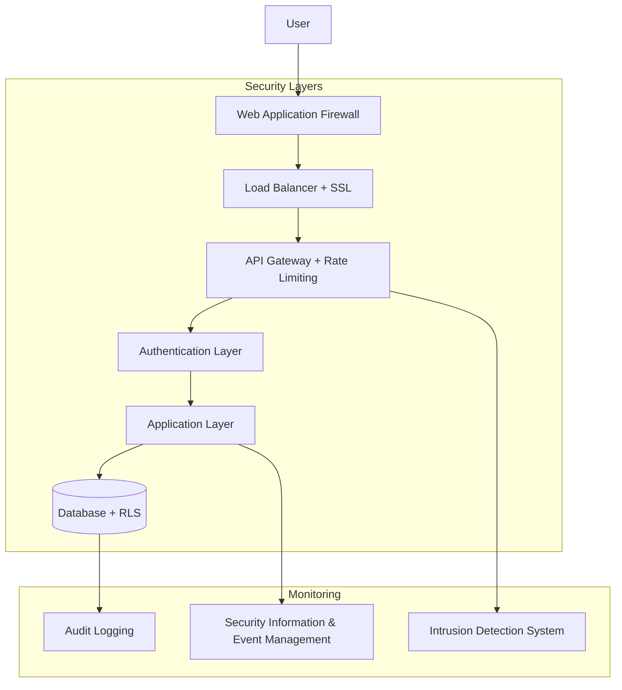

# Content Weave Platform - Security Guide

## Overview

This document outlines the comprehensive security measures, practices, and protocols implemented in the Content Weave platform. Security is a fundamental aspect of our architecture, ensuring the protection of user data, financial transactions, and platform integrity.

## Table of Contents

1. [Security Architecture](#security-architecture)
2. [Authentication & Authorization](#authentication--authorization)
3. [Data Protection](#data-protection)
4. [Network Security](#network-security)
5. [Payment Security](#payment-security)
6. [Input Validation](#input-validation)
7. [Security Headers](#security-headers)
8. [Vulnerability Management](#vulnerability-management)
9. [Incident Response](#incident-response)
10. [Compliance](#compliance)
11. [Security Monitoring](#security-monitoring)
12. [Best Practices](#best-practices)

## Security Architecture

### Defense in Depth Strategy

Content Weave implements multiple layers of security controls:



### Security Principles

1. **Least Privilege**: Users and services have minimum required permissions
2. **Zero Trust**: No implicit trust, verify everything
3. **Defense in Depth**: Multiple security layers and controls
4. **Fail Secure**: Systems fail to a secure state
5. **Security by Design**: Security built into architecture from the start

## Authentication & Authorization

### Authentication Flow

#### JWT-Based Authentication
```typescript
// Authentication service implementation
class AuthService {
  async signIn(email: string, password: string): Promise<AuthResponse> {
    // Input validation
    const validation = signInSchema.safeParse({ email, password });
    if (!validation.success) {
      throw new ValidationError('Invalid input');
    }

    // Rate limiting check
    await this.checkRateLimit(email);

    try {
      // Authenticate with Supabase
      const { data, error } = await supabase.auth.signInWithPassword({
        email: validation.data.email,
        password: validation.data.password,
      });

      if (error) {
        // Log failed attempt
        await this.logSecurityEvent('auth_failure', { email, error: error.message });
        throw new AuthenticationError('Invalid credentials');
      }

      // Log successful authentication
      await this.logSecurityEvent('auth_success', { user_id: data.user.id });

      return {
        user: data.user,
        session: data.session,
        access_token: data.session.access_token,
        refresh_token: data.session.refresh_token
      };
    } catch (error) {
      // Implement exponential backoff for failed attempts
      await this.incrementFailedAttempts(email);
      throw error;
    }
  }

  async verifyToken(token: string): Promise<User> {
    try {
      const { data: { user }, error } = await supabase.auth.getUser(token);
      
      if (error || !user) {
        throw new AuthenticationError('Invalid or expired token');
      }

      // Check if user is still active
      const { data: userProfile } = await supabase
        .from('users')
        .select('is_verified, role')
        .eq('id', user.id)
        .single();

      if (!userProfile?.is_verified) {
        throw new AuthorizationError('Account not verified');
      }

      return { ...user, role: userProfile.role };
    } catch (error) {
      await this.logSecurityEvent('token_verification_failed', { token: token.substring(0, 10) + '...' });
      throw error;
    }
  }
}
```

#### Multi-Factor Authentication (MFA)
```typescript
// MFA implementation
class MFAService {
  async enableMFA(userId: string): Promise<MFASetup> {
    const secret = authenticator.generateSecret();
    const qrCode = await QRCode.toDataURL(
      authenticator.keyuri(userId, 'Content Weave', secret)
    );

    // Store secret securely (encrypted)
    await this.storeMFASecret(userId, secret);

    return {
      secret,
      qrCode,
      backupCodes: this.generateBackupCodes()
    };
  }

  async verifyMFA(userId: string, token: string): Promise<boolean> {
    const secret = await this.getMFASecret(userId);
    const isValid = authenticator.verify({ token, secret });

    if (!isValid) {
      await this.logSecurityEvent('mfa_verification_failed', { user_id: userId });
      return false;
    }

    await this.logSecurityEvent('mfa_verification_success', { user_id: userId });
    return true;
  }
}
```

### Authorization Model

#### Role-Based Access Control (RBAC)
```sql
-- User roles and permissions
CREATE TYPE user_role AS ENUM ('creator', 'business', 'admin');

-- Role-based policies
CREATE POLICY "creators_can_view_collaborations" ON collaborations
    FOR SELECT USING (
        auth.jwt() ->> 'role' = 'creator' AND 
        creator_id = auth.uid()
    );

CREATE POLICY "businesses_can_manage_collaborations" ON collaborations
    FOR ALL USING (
        auth.jwt() ->> 'role' = 'business' AND 
        business_id = (SELECT id FROM business_profiles WHERE user_id = auth.uid())
    );

-- Admin access with additional verification
CREATE POLICY "admin_full_access" ON collaborations
    FOR ALL USING (
        auth.jwt() ->> 'role' = 'admin' AND
        EXISTS (
            SELECT 1 FROM users 
            WHERE id = auth.uid() 
            AND role = 'admin' 
            AND is_verified = true
        )
    );
```

#### Row Level Security (RLS)
```sql
-- Enable RLS on all tables
ALTER TABLE users ENABLE ROW LEVEL SECURITY;
ALTER TABLE creator_profiles ENABLE ROW LEVEL SECURITY;
ALTER TABLE business_profiles ENABLE ROW LEVEL SECURITY;
ALTER TABLE collaborations ENABLE ROW LEVEL SECURITY;
ALTER TABLE transactions ENABLE ROW LEVEL SECURITY;

-- Users can only access their own data
CREATE POLICY "users_own_data" ON users
    FOR ALL USING (auth.uid() = id);

-- Public profiles are viewable by everyone
CREATE POLICY "public_creator_profiles" ON creator_profiles
    FOR SELECT USING (
        EXISTS (
            SELECT 1 FROM users 
            WHERE id = creator_profiles.user_id
        )
    );

-- Financial data requires strict access control
CREATE POLICY "transactions_owner_access" ON transactions
    FOR SELECT USING (
        payer_id = auth.uid() OR 
        payee_id = auth.uid() OR
        auth.jwt() ->> 'role' = 'admin'
    );
```

## Data Protection

### Encryption Strategy

#### Data at Rest
```typescript
// Encryption service for sensitive data
class EncryptionService {
  private readonly algorithm = 'aes-256-gcm';
  private readonly keyDerivation = 'pbkdf2';

  async encrypt(plaintext: string, associatedData?: string): Promise<EncryptedData> {
    const salt = crypto.randomBytes(16);
    const iv = crypto.randomBytes(16);
    
    // Derive key using PBKDF2
    const key = crypto.pbkdf2Sync(
      process.env.ENCRYPTION_KEY!,
      salt,
      100000, // iterations
      32,     // key length
      'sha256'
    );

    const cipher = crypto.createCipher(this.algorithm, key);
    cipher.setAAD(Buffer.from(associatedData || ''));

    let encrypted = cipher.update(plaintext, 'utf8', 'hex');
    encrypted += cipher.final('hex');

    const authTag = cipher.getAuthTag();

    return {
      encrypted,
      salt: salt.toString('hex'),
      iv: iv.toString('hex'),
      authTag: authTag.toString('hex')
    };
  }

  async decrypt(encryptedData: EncryptedData, associatedData?: string): Promise<string> {
    const key = crypto.pbkdf2Sync(
      process.env.ENCRYPTION_KEY!,
      Buffer.from(encryptedData.salt, 'hex'),
      100000,
      32,
      'sha256'
    );

    const decipher = crypto.createDecipher(this.algorithm, key);
    decipher.setAuthTag(Buffer.from(encryptedData.authTag, 'hex'));
    decipher.setAAD(Buffer.from(associatedData || ''));

    let decrypted = decipher.update(encryptedData.encrypted, 'hex', 'utf8');
    decrypted += decipher.final('utf8');

    return decrypted;
  }
}

// Usage for sensitive fields
class UserService {
  async updateSensitiveData(userId: string, data: SensitiveUserData) {
    // Encrypt PII before storage
    const encryptedPhone = await this.encryption.encrypt(data.phone, userId);
    const encryptedAddress = await this.encryption.encrypt(data.address, userId);

    await supabase
      .from('users')
      .update({
        encrypted_phone: encryptedPhone,
        encrypted_address: encryptedAddress
      })
      .eq('id', userId);
  }
}
```

#### Data in Transit
```nginx
# SSL/TLS Configuration
ssl_protocols TLSv1.2 TLSv1.3;
ssl_ciphers ECDHE-RSA-AES256-GCM-SHA512:DHE-RSA-AES256-GCM-SHA512:ECDHE-RSA-AES256-GCM-SHA384;
ssl_prefer_server_ciphers off;
ssl_session_cache shared:SSL:10m;
ssl_session_timeout 10m;

# HSTS
add_header Strict-Transport-Security "max-age=31536000; includeSubDomains; preload" always;

# Certificate pinning
add_header Public-Key-Pins 'pin-sha256="base64+primary=="; pin-sha256="base64+backup=="; max-age=5184000; includeSubDomains';
```

### Data Classification

| Classification | Examples | Protection Level |
|---------------|----------|------------------|
| **Public** | Public profiles, venue listings | Standard encryption |
| **Internal** | User preferences, analytics | Encryption + access controls |
| **Confidential** | Personal messages, financial data | Strong encryption + audit logs |
| **Restricted** | Payment credentials, admin access | Maximum encryption + strict access |

### Data Retention and Deletion

```typescript
// Data retention service
class DataRetentionService {
  private readonly retentionPolicies = {
    'audit_logs': 7 * 365, // 7 years
    'transactions': 5 * 365, // 5 years
    'messages': 2 * 365, // 2 years
    'analytics': 1 * 365, // 1 year
    'session_logs': 90, // 90 days
  };

  async enforceRetentionPolicies(): Promise<void> {
    for (const [table, retentionDays] of Object.entries(this.retentionPolicies)) {
      const cutoffDate = new Date();
      cutoffDate.setDate(cutoffDate.getDate() - retentionDays);

      // Secure deletion with overwriting
      await this.secureDelete(table, cutoffDate);
    }
  }

  async handleDataDeletionRequest(userId: string): Promise<void> {
    // GDPR/CCPA compliance - Right to be forgotten
    const tables = [
      'users', 'creator_profiles', 'business_profiles',
      'messages', 'notifications', 'user_analytics'
    ];

    for (const table of tables) {
      await this.anonymizeUserData(table, userId);
    }

    // Keep transaction records for legal compliance but anonymize
    await this.anonymizeFinancialRecords(userId);
    
    await this.logSecurityEvent('data_deletion_completed', { user_id: userId });
  }
}
```

## Network Security

### Firewall Configuration

#### Application-Level Firewall
```typescript
// Rate limiting and DDoS protection
class SecurityMiddleware {
  private rateLimiters = new Map<string, RateLimit>();

  async applyRateLimit(req: Request, res: Response, next: NextFunction) {
    const clientIP = this.getClientIP(req);
    const endpoint = req.path;
    
    // Different limits for different endpoints
    const limits = {
      '/auth/signin': { requests: 5, window: 15 * 60 * 1000 }, // 5 per 15min
      '/api/payments': { requests: 10, window: 60 * 1000 }, // 10 per minute
      '/api/messages': { requests: 100, window: 60 * 1000 }, // 100 per minute
      default: { requests: 60, window: 60 * 1000 } // 60 per minute
    };

    const limit = limits[endpoint] || limits.default;
    
    if (await this.isRateLimited(clientIP, endpoint, limit)) {
      await this.logSecurityEvent('rate_limit_exceeded', {
        ip: clientIP,
        endpoint,
        user_agent: req.headers['user-agent']
      });
      
      return res.status(429).json({
        error: 'Rate limit exceeded',
        retry_after: Math.ceil(limit.window / 1000)
      });
    }

    next();
  }

  async detectAnomalousTraffic(req: Request): Promise<boolean> {
    const clientIP = this.getClientIP(req);
    
    // Check for suspicious patterns
    const indicators = [
      this.checkRequestFrequency(clientIP),
      this.checkUserAgentPatterns(req.headers['user-agent']),
      this.checkGeographicAnomalies(clientIP),
      this.checkPayloadAnomalies(req.body)
    ];

    const suspiciousCount = indicators.filter(Boolean).length;
    
    if (suspiciousCount >= 2) {
      await this.logSecurityEvent('anomalous_traffic_detected', {
        ip: clientIP,
        indicators: indicators.map((v, i) => v ? i : null).filter(Boolean),
        request_details: {
          method: req.method,
          path: req.path,
          user_agent: req.headers['user-agent']
        }
      });
      return true;
    }

    return false;
  }
}
```

#### Network Policies (Kubernetes)
```yaml
# k8s/network-policy.yaml
apiVersion: networking.k8s.io/v1
kind: NetworkPolicy
metadata:
  name: content-weave-network-policy
  namespace: content-weave
spec:
  podSelector:
    matchLabels:
      app: content-weave
  policyTypes:
  - Ingress
  - Egress
  
  ingress:
  # Allow traffic from ingress controller
  - from:
    - namespaceSelector:
        matchLabels:
          name: ingress-nginx
    ports:
    - protocol: TCP
      port: 8080
  
  # Allow traffic from monitoring
  - from:
    - namespaceSelector:
        matchLabels:
          name: monitoring
    ports:
    - protocol: TCP
      port: 9090  # metrics

  egress:
  # Allow HTTPS outbound
  - to: []
    ports:
    - protocol: TCP
      port: 443
    
  # Allow database connections
  - to:
    - namespaceSelector:
        matchLabels:
          name: database
    ports:
    - protocol: TCP
      port: 5432
      
  # Allow DNS
  - to: []
    ports:
    - protocol: UDP
      port: 53
```

### CORS Configuration

```typescript
// CORS security configuration
const corsOptions = {
  origin: (origin: string, callback: Function) => {
    const allowedOrigins = [
      'https://contentweave.com',
      'https://www.contentweave.com',
      'https://app.contentweave.com'
    ];

    // Allow requests with no origin (mobile apps, Postman, etc.)
    if (!origin) return callback(null, true);

    if (allowedOrigins.includes(origin)) {
      callback(null, true);
    } else {
      callback(new Error('Not allowed by CORS'));
    }
  },
  credentials: true,
  methods: ['GET', 'POST', 'PUT', 'PATCH', 'DELETE', 'OPTIONS'],
  allowedHeaders: [
    'Content-Type',
    'Authorization',
    'X-Requested-With',
    'Accept',
    'Origin'
  ],
  exposedHeaders: [
    'X-RateLimit-Limit',
    'X-RateLimit-Remaining',
    'X-RateLimit-Reset'
  ],
  maxAge: 86400 // 24 hours
};
```

## Payment Security

### PCI DSS Compliance

#### Secure Payment Processing
```typescript
// Payment service with security controls
class PaymentService {
  async createPayment(paymentData: PaymentRequest): Promise<PaymentResponse> {
    // Input validation and sanitization
    const validation = paymentSchema.safeParse(paymentData);
    if (!validation.success) {
      throw new ValidationError('Invalid payment data');
    }

    // Rate limiting for payment attempts
    await this.checkPaymentRateLimit(paymentData.user_id);

    try {
      // Create secure payment preference
      const preference = await this.createMercadoPagoPreference({
        items: [{
          title: validation.data.description,
          quantity: 1,
          unit_price: validation.data.amount,
          currency_id: 'ARS'
        }],
        payer: {
          email: validation.data.payer_email
        },
        payment_methods: {
          excluded_payment_types: [
            { id: 'ticket' }, // Exclude cash payments for security
            { id: 'atm' }
          ]
        },
        notification_url: `${process.env.WEBHOOK_URL}/mercadopago-webhook`,
        external_reference: validation.data.external_reference,
        expires: true,
        expiration_date_from: new Date().toISOString(),
        expiration_date_to: new Date(Date.now() + 30 * 60 * 1000).toISOString() // 30 minutes
      });

      // Log payment creation (without sensitive data)
      await this.logSecurityEvent('payment_created', {
        user_id: validation.data.user_id,
        amount: validation.data.amount,
        external_reference: validation.data.external_reference,
        preference_id: preference.id
      });

      return {
        preference_id: preference.id,
        init_point: preference.init_point,
        sandbox_init_point: preference.sandbox_init_point
      };

    } catch (error) {
      await this.logSecurityEvent('payment_creation_failed', {
        user_id: validation.data.user_id,
        error: error.message
      });
      throw new PaymentError('Failed to create payment');
    }
  }

  async handleWebhook(payload: WebhookPayload, signature: string): Promise<void> {
    // Verify webhook signature
    if (!this.verifyWebhookSignature(payload, signature)) {
      await this.logSecurityEvent('webhook_signature_invalid', {
        payload_id: payload.id
      });
      throw new SecurityError('Invalid webhook signature');
    }

    // Implement idempotency to prevent replay attacks
    if (await this.isProcessedWebhook(payload.id)) {
      await this.logSecurityEvent('webhook_replay_detected', {
        payload_id: payload.id
      });
      return;
    }

    // Process payment update
    await this.processPaymentUpdate(payload);
    
    // Mark webhook as processed
    await this.markWebhookProcessed(payload.id);
  }

  private verifyWebhookSignature(payload: any, signature: string): boolean {
    const secret = process.env.MERCADOPAGO_WEBHOOK_SECRET!;
    const expectedSignature = crypto
      .createHmac('sha256', secret)
      .update(JSON.stringify(payload))
      .digest('hex');

    // Use timing-safe comparison to prevent timing attacks
    return crypto.timingSafeEqual(
      Buffer.from(signature),
      Buffer.from(expectedSignature)
    );
  }
}
```

#### Transaction Monitoring
```typescript
// Transaction fraud detection
class FraudDetectionService {
  async analyzeTransaction(transaction: Transaction): Promise<FraudAnalysis> {
    const riskScore = await this.calculateRiskScore(transaction);
    
    const analysis: FraudAnalysis = {
      transaction_id: transaction.id,
      risk_score: riskScore,
      risk_level: this.getRiskLevel(riskScore),
      flags: [],
      recommendations: []
    };

    // Check for suspicious patterns
    if (await this.isVelocityAnomalous(transaction)) {
      analysis.flags.push('HIGH_VELOCITY');
      analysis.risk_score += 20;
    }

    if (await this.isAmountAnomalous(transaction)) {
      analysis.flags.push('UNUSUAL_AMOUNT');
      analysis.risk_score += 15;
    }

    if (await this.isLocationAnomalous(transaction)) {
      analysis.flags.push('GEOGRAPHIC_ANOMALY');
      analysis.risk_score += 25;
    }

    // Apply business rules
    if (analysis.risk_score > 80) {
      analysis.recommendations.push('BLOCK_TRANSACTION');
    } else if (analysis.risk_score > 60) {
      analysis.recommendations.push('REQUIRE_ADDITIONAL_VERIFICATION');
    }

    await this.logSecurityEvent('fraud_analysis_completed', analysis);
    
    return analysis;
  }

  private async calculateRiskScore(transaction: Transaction): Promise<number> {
    let score = 0;

    // User history analysis
    const userHistory = await this.getUserTransactionHistory(transaction.payer_id);
    if (userHistory.length < 3) {
      score += 10; // New user risk
    }

    // Time-based analysis
    const hour = new Date().getHours();
    if (hour < 6 || hour > 22) {
      score += 5; // Off-hours transaction
    }

    // Amount analysis
    const avgAmount = userHistory.reduce((sum, t) => sum + t.amount, 0) / userHistory.length;
    if (transaction.amount > avgAmount * 3) {
      score += 15; // Significantly higher than average
    }

    return Math.min(score, 100);
  }
}
```

## Input Validation

### Comprehensive Validation Schema

```typescript
// Zod schemas for input validation
import { z } from 'zod';

// User registration validation
export const userRegistrationSchema = z.object({
  email: z.string()
    .email('Invalid email format')
    .max(255, 'Email too long')
    .refine(email => !email.includes('+'), 'Plus signs not allowed in email'),
  
  password: z.string()
    .min(8, 'Password must be at least 8 characters')
    .max(128, 'Password too long')
    .regex(/^(?=.*[a-z])(?=.*[A-Z])(?=.*\d)(?=.*[@$!%*?&])[A-Za-z\d@$!%*?&]/, 
           'Password must contain uppercase, lowercase, number, and special character'),
  
  full_name: z.string()
    .min(1, 'Name is required')
    .max(100, 'Name too long')
    .regex(/^[a-zA-Z\s'-]+$/, 'Name contains invalid characters'),
  
  role: z.enum(['creator', 'business'], {
    required_error: 'Role is required',
    invalid_type_error: 'Invalid role'
  }),

  terms_accepted: z.literal(true, {
    errorMap: () => ({ message: 'You must accept the terms and conditions' })
  })
});

// Business profile validation
export const businessProfileSchema = z.object({
  company_name: z.string()
    .min(1, 'Company name is required')
    .max(200, 'Company name too long')
    .refine(name => name.trim().length > 0, 'Company name cannot be empty'),
  
  cuit: z.string()
    .regex(/^\d{2}-\d{8}-\d{1}$/, 'CUIT must be in format XX-XXXXXXXX-X')
    .refine(async (cuit) => {
      // Verify CUIT checksum
      return await this.validateCUITChecksum(cuit);
    }, 'Invalid CUIT number'),
  
  website_url: z.string()
    .url('Invalid URL format')
    .max(500, 'URL too long')
    .optional()
    .refine(async (url) => {
      if (!url) return true;
      // Check if domain is not in blacklist
      return await this.isAllowedDomain(url);
    }, 'Domain not allowed'),
  
  marketing_budget_range: z.enum([
    '$1,000-$5,000',
    '$5,000-$10,000', 
    '$10,000-$50,000',
    '$50,000-$100,000',
    '$100,000+'
  ])
});

// Payment validation
export const paymentSchema = z.object({
  amount: z.number()
    .positive('Amount must be positive')
    .max(1000000, 'Amount too large')
    .refine(amount => amount % 1 === 0, 'Amount must be a whole number'),
  
  description: z.string()
    .min(1, 'Description is required')
    .max(500, 'Description too long')
    .refine(desc => !/<script|javascript:|data:/i.test(desc), 'Invalid characters in description'),
  
  payer_email: z.string().email('Invalid email format'),
  
  external_reference: z.string()
    .regex(/^[a-zA-Z0-9_-]+$/, 'Invalid reference format')
    .max(100, 'Reference too long')
});

// SQL injection prevention
export const sanitizeInput = (input: string): string => {
  return input
    .replace(/['"\\;]/g, '') // Remove dangerous characters
    .replace(/--/g, '') // Remove SQL comment markers
    .replace(/\/\*.*?\*\//g, '') // Remove SQL block comments
    .trim();
};

// XSS prevention
export const sanitizeHTML = (input: string): string => {
  return DOMPurify.sanitize(input, {
    ALLOWED_TAGS: ['b', 'i', 'em', 'strong', 'p', 'br'],
    ALLOWED_ATTR: []
  });
};
```

### Server-Side Validation

```typescript
// Validation middleware
class ValidationMiddleware {
  static validate(schema: z.ZodSchema) {
    return async (req: Request, res: Response, next: NextFunction) => {
      try {
        // Validate request body
        const validatedData = await schema.parseAsync(req.body);
        
        // Replace request body with validated data
        req.body = validatedData;
        
        next();
      } catch (error) {
        if (error instanceof z.ZodError) {
          // Log validation failure
          await this.logSecurityEvent('validation_failed', {
            path: req.path,
            errors: error.errors,
            ip: req.ip
          });

          return res.status(422).json({
            error: 'Validation failed',
            details: error.errors.map(err => ({
              field: err.path.join('.'),
              message: err.message
            }))
          });
        }
        
        next(error);
      }
    };
  }

  static sanitizeRequest(req: Request, res: Response, next: NextFunction) {
    // Sanitize all string inputs
    const sanitizeObject = (obj: any): any => {
      if (typeof obj === 'string') {
        return sanitizeInput(obj);
      }
      if (Array.isArray(obj)) {
        return obj.map(sanitizeObject);
      }
      if (obj && typeof obj === 'object') {
        const sanitized: any = {};
        for (const [key, value] of Object.entries(obj)) {
          sanitized[key] = sanitizeObject(value);
        }
        return sanitized;
      }
      return obj;
    };

    req.body = sanitizeObject(req.body);
    req.query = sanitizeObject(req.query);
    req.params = sanitizeObject(req.params);

    next();
  }
}

// Usage in routes
app.post('/api/users', 
  ValidationMiddleware.sanitizeRequest,
  ValidationMiddleware.validate(userRegistrationSchema),
  createUser
);
```

## Security Headers

### HTTP Security Headers Configuration

```typescript
// Security headers middleware
class SecurityHeaders {
  static apply(req: Request, res: Response, next: NextFunction) {
    // Content Security Policy
    res.setHeader('Content-Security-Policy', [
      "default-src 'self'",
      "script-src 'self' 'unsafe-inline' https://sdk.mercadopago.com",
      "style-src 'self' 'unsafe-inline' https://fonts.googleapis.com",
      "img-src 'self' data: https: blob:",
      "font-src 'self' https://fonts.gstatic.com data:",
      "connect-src 'self' https://xmtjzfnddkuxdertnriq.supabase.co wss://xmtjzfnddkuxdertnriq.supabase.co https://api.mercadopago.com",
      "frame-src 'none'",
      "object-src 'none'",
      "base-uri 'self'",
      "form-action 'self'",
      "upgrade-insecure-requests"
    ].join('; '));

    // Strict Transport Security
    res.setHeader('Strict-Transport-Security', 
      'max-age=31536000; includeSubDomains; preload');

    // X-Frame-Options
    res.setHeader('X-Frame-Options', 'DENY');

    // X-Content-Type-Options
    res.setHeader('X-Content-Type-Options', 'nosniff');

    // X-XSS-Protection
    res.setHeader('X-XSS-Protection', '1; mode=block');

    // Referrer Policy
    res.setHeader('Referrer-Policy', 'strict-origin-when-cross-origin');

    // Permissions Policy
    res.setHeader('Permissions-Policy', [
      'camera=()',
      'microphone=()',
      'geolocation=()',
      'payment=(self)',
      'usb=()',
      'bluetooth=()'
    ].join(', '));

    // Remove server information
    res.removeHeader('X-Powered-By');
    res.setHeader('Server', 'Content-Weave');

    next();
  }
}
```

### Nginx Security Configuration

```nginx
# nginx security configuration
server {
    # Security headers
    add_header Strict-Transport-Security "max-age=31536000; includeSubDomains; preload" always;
    add_header X-Content-Type-Options nosniff always;
    add_header X-Frame-Options DENY always;
    add_header X-XSS-Protection "1; mode=block" always;
    add_header Referrer-Policy "strict-origin-when-cross-origin" always;
    
    # Content Security Policy
    add_header Content-Security-Policy "default-src 'self'; script-src 'self' 'unsafe-inline' https://sdk.mercadopago.com; style-src 'self' 'unsafe-inline' https://fonts.googleapis.com; img-src 'self' data: https: blob:; font-src 'self' https://fonts.gstatic.com data:; connect-src 'self' https://xmtjzfnddkuxdertnriq.supabase.co wss://xmtjzfnddkuxdertnriq.supabase.co https://api.mercadopago.com; frame-src 'none'; object-src 'none'; base-uri 'self'; form-action 'self'; upgrade-insecure-requests;" always;

    # Hide server version
    server_tokens off;

    # Request size limits
    client_max_body_size 10M;
    client_body_buffer_size 128k;
    
    # Timeout configurations
    client_body_timeout 12;
    client_header_timeout 12;
    keepalive_timeout 15;
    send_timeout 10;

    # Buffer overflow protection
    client_body_buffer_size 1K;
    client_header_buffer_size 1k;
    large_client_header_buffers 2 1k;

    # Rate limiting
    limit_req_zone $binary_remote_addr zone=api:10m rate=10r/s;
    limit_req_zone $binary_remote_addr zone=auth:10m rate=5r/s;
    limit_req_zone $binary_remote_addr zone=payment:10m rate=2r/s;

    location /api/ {
        limit_req zone=api burst=20 nodelay;
        proxy_pass http://app:8080;
    }

    location /auth/ {
        limit_req zone=auth burst=10 nodelay;
        proxy_pass http://app:8080;
    }

    location /api/payments/ {
        limit_req zone=payment burst=5 nodelay;
        proxy_pass http://app:8080;
    }
}
```

## Vulnerability Management

### Automated Scanning

#### Dependency Scanning
```yaml
# .github/workflows/security-scan.yml
name: Security Scan

on:
  push:
    branches: [ main, develop ]
  pull_request:
    branches: [ main ]
  schedule:
    - cron: '0 2 * * 1' # Weekly scan

jobs:
  dependency-scan:
    runs-on: ubuntu-latest
    steps:
    - uses: actions/checkout@v3
    
    - name: Run npm audit
      run: |
        npm audit --audit-level=moderate
        npm audit --json > audit-results.json
    
    - name: Upload audit results
      uses: github/codeql-action/upload-sarif@v2
      with:
        sarif_file: audit-results.json

  container-scan:
    runs-on: ubuntu-latest
    steps:
    - uses: actions/checkout@v3
    
    - name: Build container
      run: docker build -t content-weave:latest .
    
    - name: Run Trivy vulnerability scanner
      uses: aquasecurity/trivy-action@master
      with:
        image-ref: 'content-weave:latest'
        format: 'sarif'
        output: 'trivy-results.sarif'
    
    - name: Upload Trivy scan results
      uses: github/codeql-action/upload-sarif@v2
      with:
        sarif_file: 'trivy-results.sarif'

  code-scan:
    runs-on: ubuntu-latest
    steps:
    - uses: actions/checkout@v3
    
    - name: Initialize CodeQL
      uses: github/codeql-action/init@v2
      with:
        languages: javascript, typescript
        
    - name: Perform CodeQL Analysis
      uses: github/codeql-action/analyze@v2
```

#### Security Testing
```typescript
// Security test suite
describe('Security Tests', () => {
  describe('Authentication', () => {
    test('should prevent SQL injection in login', async () => {
      const maliciousInput = "'; DROP TABLE users; --";
      
      const response = await request(app)
        .post('/auth/signin')
        .send({
          email: maliciousInput,
          password: 'password'
        });

      expect(response.status).toBe(422);
      expect(response.body.error).toContain('Validation failed');
    });

    test('should prevent XSS in user input', async () => {
      const xssPayload = '<script>alert("xss")</script>';
      
      const response = await request(app)
        .post('/api/users')
        .set('Authorization', `Bearer ${validToken}`)
        .send({
          full_name: xssPayload
        });

      expect(response.status).toBe(422);
    });

    test('should enforce rate limiting', async () => {
      const promises = Array.from({ length: 10 }, () =>
        request(app)
          .post('/auth/signin')
          .send({
            email: 'test@example.com',
            password: 'wrongpassword'
          })
      );

      const responses = await Promise.all(promises);
      const rateLimitedResponses = responses.filter(r => r.status === 429);
      
      expect(rateLimitedResponses.length).toBeGreaterThan(0);
    });
  });

  describe('Authorization', () => {
    test('should prevent unauthorized access to user data', async () => {
      const response = await request(app)
        .get('/api/users/other-user-id')
        .set('Authorization', `Bearer ${userToken}`);

      expect(response.status).toBe(403);
    });

    test('should enforce role-based access control', async () => {
      const response = await request(app)
        .get('/api/admin/users')
        .set('Authorization', `Bearer ${creatorToken}`);

      expect(response.status).toBe(403);
    });
  });

  describe('Input Validation', () => {
    test('should validate payment amounts', async () => {
      const response = await request(app)
        .post('/api/payments')
        .set('Authorization', `Bearer ${validToken}`)
        .send({
          amount: -100, // Negative amount
          description: 'Test payment'
        });

      expect(response.status).toBe(422);
      expect(response.body.error).toContain('Amount must be positive');
    });
  });
});
```

### Vulnerability Response Process

1. **Detection**: Automated scanning + manual reporting
2. **Assessment**: Risk evaluation and severity classification
3. **Prioritization**: Based on CVSS score and business impact
4. **Remediation**: Patch development and testing
5. **Deployment**: Coordinated release and monitoring
6. **Verification**: Post-deployment security testing

## Incident Response

### Security Incident Classification

| Severity | Examples | Response Time | Escalation |
|----------|----------|---------------|------------|
| **Critical** | Data breach, payment fraud | 1 hour | CEO, Legal |
| **High** | Unauthorized access, service disruption | 4 hours | CTO, Security Team |
| **Medium** | Suspicious activity, failed attacks | 24 hours | Security Team |
| **Low** | Policy violations, minor issues | 72 hours | IT Team |

### Incident Response Plan

```typescript
// Incident response automation
class IncidentResponseService {
  async handleSecurityIncident(incident: SecurityIncident): Promise<void> {
    // 1. Immediate containment
    await this.containIncident(incident);

    // 2. Assess severity and impact
    const assessment = await this.assessIncident(incident);

    // 3. Notify stakeholders
    await this.notifyStakeholders(assessment);

    // 4. Begin investigation
    await this.initiateInvestigation(incident);

    // 5. Document incident
    await this.documentIncident(incident, assessment);
  }

  private async containIncident(incident: SecurityIncident): Promise<void> {
    switch (incident.type) {
      case 'DATA_BREACH':
        // Immediately disable affected accounts
        await this.disableAffectedAccounts(incident.affected_users);
        // Rotate API keys
        await this.rotateAPIKeys();
        break;

      case 'PAYMENT_FRAUD':
        // Block suspicious transactions
        await this.blockSuspiciousTransactions(incident.transaction_ids);
        // Notify payment processor
        await this.notifyPaymentProcessor(incident);
        break;

      case 'UNAUTHORIZED_ACCESS':
        // Force logout affected sessions
        await this.invalidateSessions(incident.affected_sessions);
        // Enable additional monitoring
        await this.enableEnhancedMonitoring();
        break;
    }
  }

  private async notifyStakeholders(assessment: IncidentAssessment): Promise<void> {
    const notifications = [];

    // Internal notifications
    if (assessment.severity >= 'HIGH') {
      notifications.push(
        this.notifySecurityTeam(assessment),
        this.notifyCTO(assessment)
      );
    }

    if (assessment.severity === 'CRITICAL') {
      notifications.push(
        this.notifyCEO(assessment),
        this.notifyLegalTeam(assessment)
      );
    }

    // External notifications (if required)
    if (assessment.requires_user_notification) {
      notifications.push(this.notifyAffectedUsers(assessment));
    }

    if (assessment.requires_regulatory_notification) {
      notifications.push(this.notifyRegulators(assessment));
    }

    await Promise.all(notifications);
  }
}
```

### Breach Notification Procedures

```typescript
// Data breach notification
class BreachNotificationService {
  async handleDataBreach(breach: DataBreach): Promise<void> {
    const assessment = await this.assessBreach(breach);

    // Internal notification (immediate)
    await this.notifyInternalTeams(assessment);

    // User notification (within 72 hours of discovery)
    if (assessment.affects_personal_data) {
      await this.scheduleUserNotification(assessment, 72 * 60 * 60 * 1000);
    }

    // Regulatory notification (within 72 hours)
    if (assessment.requires_regulatory_notification) {
      await this.scheduleRegulatoryNotification(assessment, 72 * 60 * 60 * 1000);
    }

    // Public disclosure (if required)
    if (assessment.requires_public_disclosure) {
      await this.schedulePublicDisclosure(assessment);
    }
  }

  private async notifyAffectedUsers(breach: DataBreach): Promise<void> {
    const template = await this.getBreachNotificationTemplate(breach.type);
    
    for (const userId of breach.affected_users) {
      await this.sendSecureNotification(userId, {
        subject: 'Important Security Notice - Content Weave',
        template,
        data: {
          incident_id: breach.id,
          incident_date: breach.discovered_at,
          affected_data: breach.affected_data_types,
          recommended_actions: this.getRecommendedActions(breach)
        }
      });
    }
  }
}
```

## Compliance

### GDPR Compliance

```typescript
// GDPR compliance service
class GDPRComplianceService {
  async handleDataSubjectRequest(request: DataSubjectRequest): Promise<void> {
    switch (request.type) {
      case 'ACCESS':
        await this.provideDataAccess(request);
        break;
      case 'RECTIFICATION':
        await this.rectifyData(request);
        break;
      case 'ERASURE':
        await this.eraseData(request);
        break;
      case 'PORTABILITY':
        await this.provideDataPortability(request);
        break;
      case 'RESTRICTION':
        await this.restrictProcessing(request);
        break;
    }
  }

  async provideDataAccess(request: DataSubjectRequest): Promise<DataExport> {
    const userData = await this.collectUserData(request.user_id);
    
    // Remove sensitive internal data
    const exportData = this.sanitizeForExport(userData);
    
    // Create encrypted export
    const encryptedExport = await this.encryptExport(exportData);
    
    await this.logDataAccess(request.user_id, 'data_export_created');
    
    return encryptedExport;
  }

  async eraseData(request: DataSubjectRequest): Promise<void> {
    // Verify legal basis for erasure
    if (!this.canEraseData(request)) {
      throw new ComplianceError('Data cannot be erased due to legal obligations');
    }

    // Soft delete user data (mark as deleted but keep for legal compliance)
    await this.softDeleteUserData(request.user_id);
    
    // Hard delete non-essential data
    await this.hardDeleteNonEssentialData(request.user_id);
    
    // Anonymize transaction records (keep for financial compliance)
    await this.anonymizeTransactionData(request.user_id);
    
    await this.logDataErasure(request.user_id);
  }
}
```

### PCI DSS Compliance

```typescript
// PCI DSS compliance controls
class PCIComplianceService {
  // Requirement 1 & 2: Network security and system hardening
  async validateNetworkSecurity(): Promise<ComplianceReport> {
    const checks = [
      this.validateFirewallConfiguration(),
      this.validateSystemHardening(),
      this.validateNetworkSegmentation()
    ];

    const results = await Promise.all(checks);
    return this.generateComplianceReport('PCI_NETWORK_SECURITY', results);
  }

  // Requirement 3: Protect stored cardholder data
  async validateDataProtection(): Promise<ComplianceReport> {
    // We use MercadoPago for payment processing, so we don't store card data
    // But we need to ensure we don't inadvertently capture or store it
    
    const checks = [
      this.validateNoCardDataStorage(),
      this.validateEncryptionStandards(),
      this.validateKeyManagement()
    ];

    const results = await Promise.all(checks);
    return this.generateComplianceReport('PCI_DATA_PROTECTION', results);
  }

  // Requirement 8: Strong access control
  async validateAccessControl(): Promise<ComplianceReport> {
    const checks = [
      this.validateUserAuthentication(),
      this.validatePasswordPolicy(),
      this.validateMFAImplementation(),
      this.validateAccessReviews()
    ];

    const results = await Promise.all(checks);
    return this.generateComplianceReport('PCI_ACCESS_CONTROL', results);
  }

  // Requirement 10: Log and monitor all access
  async validateLoggingAndMonitoring(): Promise<ComplianceReport> {
    const checks = [
      this.validateAuditLogging(),
      this.validateLogReview(),
      this.validateMonitoringSystem(),
      this.validateIncidentResponse()
    ];

    const results = await Promise.all(checks);
    return this.generateComplianceReport('PCI_LOGGING_MONITORING', results);
  }
}
```

## Security Monitoring

### Security Information and Event Management (SIEM)

```typescript
// Security event monitoring
class SecurityMonitoringService {
  private alertRules = [
    {
      name: 'Multiple Failed Logins',
      condition: 'failed_login_count > 5 AND time_window < 15_minutes',
      severity: 'HIGH',
      action: 'BLOCK_IP'
    },
    {
      name: 'Unusual Payment Pattern',
      condition: 'payment_amount > avg_amount * 5 AND user_age < 7_days',
      severity: 'MEDIUM',
      action: 'REQUIRE_VERIFICATION'
    },
    {
      name: 'Admin Access Outside Hours',
      condition: 'user_role = admin AND (hour < 8 OR hour > 18)',
      severity: 'LOW',
      action: 'LOG_AND_NOTIFY'
    }
  ];

  async processSecurityEvent(event: SecurityEvent): Promise<void> {
    // Enrich event with context
    const enrichedEvent = await this.enrichEvent(event);

    // Evaluate against alert rules
    const triggeredRules = this.evaluateRules(enrichedEvent);

    // Execute automated responses
    for (const rule of triggeredRules) {
      await this.executeAutomatedResponse(rule, enrichedEvent);
    }

    // Store event for analysis
    await this.storeSecurityEvent(enrichedEvent);

    // Update threat intelligence
    await this.updateThreatIntelligence(enrichedEvent);
  }

  private async enrichEvent(event: SecurityEvent): Promise<EnrichedSecurityEvent> {
    const enrichment = await Promise.all([
      this.getGeoLocation(event.ip_address),
      this.getUserContext(event.user_id),
      this.getHistoricalContext(event),
      this.getThreatIntelligence(event.ip_address)
    ]);

    return {
      ...event,
      geo_location: enrichment[0],
      user_context: enrichment[1],
      historical_context: enrichment[2],
      threat_intelligence: enrichment[3],
      risk_score: this.calculateRiskScore(event, enrichment)
    };
  }

  private async executeAutomatedResponse(rule: AlertRule, event: EnrichedSecurityEvent): Promise<void> {
    switch (rule.action) {
      case 'BLOCK_IP':
        await this.blockIPAddress(event.ip_address);
        break;
      case 'REQUIRE_VERIFICATION':
        await this.requireAdditionalVerification(event.user_id);
        break;
      case 'LOCK_ACCOUNT':
        await this.lockUserAccount(event.user_id);
        break;
      case 'LOG_AND_NOTIFY':
        await this.notifySecurityTeam(rule, event);
        break;
    }
  }
}
```

### Threat Detection

```typescript
// Advanced threat detection
class ThreatDetectionService {
  async analyzeUserBehavior(userId: string): Promise<ThreatAnalysis> {
    const userProfile = await this.buildUserProfile(userId);
    const recentActivity = await this.getRecentActivity(userId);
    
    const anomalies = [
      await this.detectLoginAnomalies(userProfile, recentActivity),
      await this.detectTransactionAnomalies(userProfile, recentActivity),
      await this.detectNavigationAnomalies(userProfile, recentActivity),
      await this.detectDeviceAnomalies(userProfile, recentActivity)
    ].filter(Boolean);

    const riskScore = this.calculateBehaviorRiskScore(anomalies);

    return {
      user_id: userId,
      risk_score: riskScore,
      anomalies,
      recommendations: this.generateRecommendations(riskScore, anomalies),
      timestamp: new Date()
    };
  }

  private async detectLoginAnomalies(profile: UserProfile, activity: UserActivity[]): Promise<Anomaly | null> {
    const loginEvents = activity.filter(a => a.type === 'login');
    
    // Time-based anomalies
    const usualHours = profile.typical_login_hours;
    const currentHour = new Date().getHours();
    
    if (!usualHours.includes(currentHour)) {
      return {
        type: 'UNUSUAL_LOGIN_TIME',
        severity: 'LOW',
        details: { current_hour: currentHour, usual_hours: usualHours }
      };
    }

    // Geographic anomalies
    const recentLocations = loginEvents.slice(-5).map(e => e.location);
    const currentLocation = activity[0]?.location;
    
    if (currentLocation && !this.isLocationNormal(currentLocation, recentLocations)) {
      return {
        type: 'UNUSUAL_LOGIN_LOCATION',
        severity: 'HIGH',
        details: { current_location: currentLocation, recent_locations: recentLocations }
      };
    }

    return null;
  }

  private async detectTransactionAnomalies(profile: UserProfile, activity: UserActivity[]): Promise<Anomaly | null> {
    const transactions = activity.filter(a => a.type === 'transaction');
    
    if (transactions.length === 0) return null;

    const avgAmount = profile.average_transaction_amount;
    const recentAmount = transactions[0].amount;

    // Amount anomaly
    if (recentAmount > avgAmount * 3) {
      return {
        type: 'UNUSUAL_TRANSACTION_AMOUNT',
        severity: 'MEDIUM',
        details: { amount: recentAmount, average: avgAmount }
      };
    }

    // Velocity anomaly
    const recentTransactionCount = transactions.filter(
      t => Date.now() - t.timestamp < 60 * 60 * 1000 // Last hour
    ).length;

    if (recentTransactionCount > profile.max_hourly_transactions) {
      return {
        type: 'HIGH_TRANSACTION_VELOCITY',
        severity: 'HIGH',
        details: { count: recentTransactionCount, max: profile.max_hourly_transactions }
      };
    }

    return null;
  }
}
```

## Best Practices

### Secure Development Lifecycle

1. **Planning Phase**
   - Security requirements gathering
   - Threat modeling
   - Risk assessment

2. **Design Phase**
   - Security architecture review
   - Secure design patterns
   - Privacy by design

3. **Development Phase**
   - Secure coding standards
   - Static code analysis
   - Peer code reviews

4. **Testing Phase**
   - Security testing
   - Penetration testing
   - Vulnerability assessment

5. **Deployment Phase**
   - Security configuration
   - Infrastructure security
   - Monitoring setup

6. **Maintenance Phase**
   - Regular security updates
   - Continuous monitoring
   - Incident response

### Developer Security Guidelines

#### Secure Coding Checklist
- [ ] Input validation on all user inputs
- [ ] Output encoding to prevent XSS
- [ ] Parameterized queries to prevent SQL injection
- [ ] Proper authentication and authorization checks
- [ ] Secure session management
- [ ] Error handling without information disclosure
- [ ] Secure cryptographic implementations
- [ ] Protection against CSRF attacks
- [ ] Rate limiting on sensitive endpoints
- [ ] Security logging and monitoring

#### Security Code Review Checklist
- [ ] Authentication mechanisms properly implemented
- [ ] Authorization checks in place for all protected resources
- [ ] Input validation and sanitization applied
- [ ] Sensitive data properly encrypted
- [ ] Error messages don't leak sensitive information
- [ ] Rate limiting configured appropriately
- [ ] Security headers configured
- [ ] Logging captures security-relevant events
- [ ] No hardcoded secrets or credentials
- [ ] Dependencies are up-to-date and secure

### Security Training and Awareness

#### Topics for Security Training
1. **OWASP Top 10** vulnerabilities and mitigation
2. **Secure coding practices** for React and TypeScript
3. **Authentication and authorization** best practices
4. **Data protection** and privacy requirements
5. **Incident response** procedures
6. **Social engineering** awareness
7. **Supply chain security** for dependencies
8. **Cloud security** for Supabase and deployment platforms

## Contact and Support

### Security Team
- **Security Email**: security@contentweave.com
- **Bug Bounty Program**: bugbounty@contentweave.com
- **Emergency Contact**: +1-XXX-XXX-XXXX (24/7)

### Reporting Security Issues
1. **Email**: security@contentweave.com with "SECURITY ISSUE" in subject
2. **Bug Bounty**: Report through our bug bounty program
3. **Responsible Disclosure**: We follow a 90-day disclosure timeline

### Security Resources
- [OWASP Guidelines](https://owasp.org/)
- [NIST Cybersecurity Framework](https://www.nist.gov/cyberframework)
- [Supabase Security Documentation](https://supabase.com/docs/guides/platform/security)
- [React Security Best Practices](https://snyk.io/blog/10-react-security-best-practices/)

---

**Content Weave Security** - Protecting our platform, users, and data through comprehensive security measures and best practices.